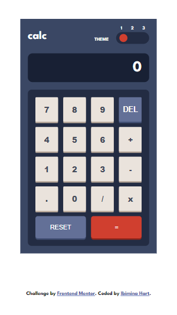
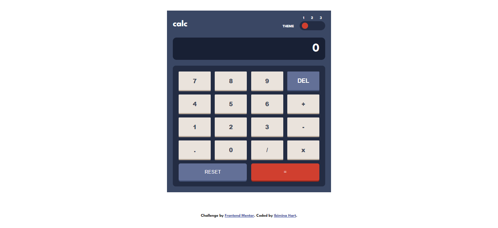

# Frontend Mentor - Calculator app solution

This is a solution to the [Calculator app challenge on Frontend Mentor](https://www.frontendmentor.io/challenges/calculator-app-9lteq5N29). Frontend Mentor challenges help you improve your coding skills by building realistic projects. 

## Table of contents

- [Overview](#overview)
  - [The challenge](#the-challenge)
  - [Screenshot](#screenshot)
  - [Links](#links)
- [My process](#my-process)
  - [Built with](#built-with)
  - [What I learned](#what-i-learned)
  - [Continued development](#continued-development)
  - [Useful resources](#useful-resources)
- [Author](#author)
- [Acknowledgments](#acknowledgments)


## Overview

### The challenge

Users should be able to:

- See the size of the elements adjust based on their device's screen size
- Perform mathmatical operations like addition, subtraction, multiplication, and division
- Adjust the color theme based on their preference
- **Bonus**: Have their initial theme preference checked using `prefers-color-scheme` and have any additional changes saved in the browser

### Screenshot





### Links

- Solution URL: [https://github.com/ibimina/calculator-app-main](https://github.com/ibimina/calculator-app-main)
- Live Site URL: [https://ibimina.github.io/calculator-app-main/](https://ibimina.github.io/calculator-app-main/)

## My process

### Built with

- Semantic HTML5 markup
- CSS custom properties
- Flexbox
- CSS Grid
- Mobile-first workflow


### What I learned
  How to create Css variable
```css
.blue {
  --bg-color: hsl(222, 26%, 31%);
  --header-text: #fff;
  --input-color: hsl(223, 31%, 20%);
  --range-ball: hsl(6, 63%, 50%);
  --display-bg: hsl(224, 36%, 15%);
  --display-text: hsl(0, 0%, 100%);
  --button-color: hsl(221, 14%, 31%);
  --button-bg: hsl(30, 25%, 89%);
  --button-shadow: hsl(28, 16%, 65%);
  --delete-bg: hsl(225, 21%, 49%);
  --delete-shadow: hsl(224, 28%, 35%);
  --equals-shadow: hsl(6, 70%, 34%);
  --equals-text: hsl(0, 0%, 100%);
}
```

How to change theme color
```js
const changeColor = (newTheme) => {
  if (newTheme === "0") {
    body.classList.remove(currentTheme);
    body.classList.add("blue");
    currentTheme = "blue";
     localStorage.setItem("mytheme",currentTheme);
     localStorage.setItem("val",0)
  }
  if (newTheme === "1") {
    body.classList.remove(currentTheme);
    body.classList.add("white");
    currentTheme = "white";
 localStorage.setItem("mytheme", currentTheme);
      localStorage.setItem("val", 1);
  }
  if (newTheme === "2") {
    body.classList.remove(currentTheme);
    body.classList.add("purple");
    currentTheme = "purple";
    localStorage.setItem("mytheme", currentTheme);
         localStorage.setItem("val", 2);
  }
  
};
```

How to store user preferred theme

```js
let currentTheme = localStorage.getItem("mytheme") || "blue"
body.classList.add(currentTheme);
range.value = localStorage.getItem("val");
```


### Continued development
 Calculation using Javascript 


### Useful resources

- [Switching themes using Javascript resource 1](https://techinscribed.com/multiple-themes-using-css-variables/) - This helped me understand css variables how to apply them and also switching background theme. I really liked this pattern and will use it going forward.
- [Arithmetic calculation resource 2](zell@zellwk.com) - This is an amazing article which helped me finally understand javascript calculation. I'd recommend it to anyone still learning this concept.


## Author

- Frontend Mentor - [@ibimina](https://www.frontendmentor.io/profile/ibimina)
- Twitter - [@ibimina](https://www.twitter.com/ibiminaaH)


## Acknowledgments

Zell Liew

